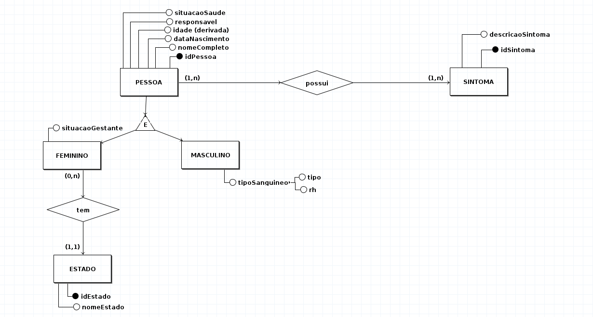

# Problema

Criar uma base de dados para cadastrar pessoas com: nome, sexo, idade(dataNascimento), identificador inteiro e responsavel unico por cada registro que inicia com valor a partir de 100 e situacao de saude **S** = Sem contaminacao; **T** = contaminado em tratamento; **C** = contaminado curado; **F** = contaminado falecido. Somente para sexo feminino eh cadastrado estado de origem e se ja foi gestante(**S**=sim, **N**=nao, **C**=nao tem certeza). Somente para sexo masculino cadastrar tipo de sangue - (**A, B, AB, O** e **RH** = + ou -).

- Deverao registrar os sintomas(possuir um ou mais - nao nulo);
- So pode haver um registro de estado por mulher.

## ME-R

### ENTIDADES

- PESSOA;
- FEMININO;
- MASCULINO;
- ESTADO;
- SINTOMA.

### ATRIBUTOS

- PESSOA ( <ins>idPessoa</ins>, nomeCompleto, sexo, dataNascimento,responsavel, situacaoSaude );
- FEMININO (situacaoGestante);
- MASCULINO (tipoSanguineo(tipo, rh));
- SINTOMAS ( <ins>idSintoma</ins>, descricaoSintoma).
- ESTADO (<ins>idEstado</ins>, nomeEstado).

### RELACIONAMENTOS

- PESSOA - **possui** - SINTOMA

  1. Uma pessoa pode possuir zero ou varios SINTOMA(s) e uma SINTOMA pode ser possuido por varias ou nenhuma PESSOA(s);
  1. Cardinalidade N:N.

- FEMININO - **tem** ESTADO
  1. Um FEMININO pode tem um ESTADO e um ESTADO pode ter varios ou nenhum FEMININO(s);
  1. Cardinalidade N:1.

## DE-R

## Diagrama Logico

## ITEM D

- Foi necessario utilizar a especializacao exclusiva para entidade PESSOA, nas quais as entidades FEMININO e MASCULINO sao divisoes da mesma e eh necessario obrigatoriamente que uma e apenas uma delas seja adotada.