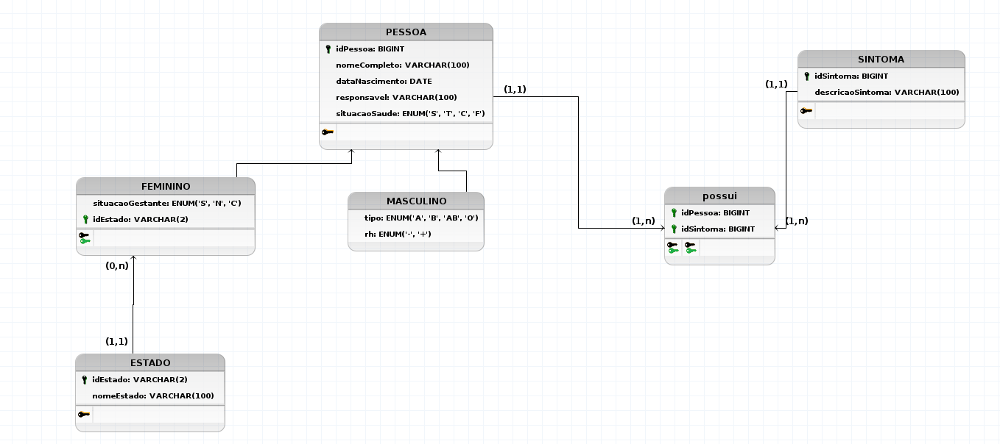

# Problema

Criar uma base de dados para cadastrar pessoas com: nome, sexo, idade(dataNacimento), identificador inteiro e responsavel unico por cada registro que inicia com valor a partir de 100 e situacao de saude **S** = Sem contaminacao; **T** = contaminado em tratamento; **C** = contaminado curado; **F** = contaminado falecido. Somente para sexo feminino eh cadastrado estado de origem e se ja foi gestante(**S**=sim, **N**=nao, **C**=nao tem certeza). Somente para sexo masculino cadastrar tipo de sangue - (**A, B, AB, O** e **RH** = + ou -).

- Deverao registrar os sintomas(possuir um ou mais - nao nulo);
- So pode haver um registro de estado por mulher.

## ME-R

### ENTIDADES

- PESSOA;
- SINTOMA.

### ATRIBUTOS

- PESSOA ( <ins>idPessoa</ins>, nomeCompleto, sexo, dataNascimento,responsavel, situacaoSaude, tipoSanguineo, estado, situacaoGestante );
- SINTOMAS ( <ins>idSintoma</ins>, dataHora, descricaoSintoma).

### RELACIONAMETOS

- PESSOA - **tem** - SINTOMA
  1. Uma pessoa pode ter zero ou varios SINTOMA(s) e uma SINTOMA pode ser tido por apenas uma PESSOA;
  1. Cardinalidade 1:N.

## DE-R

